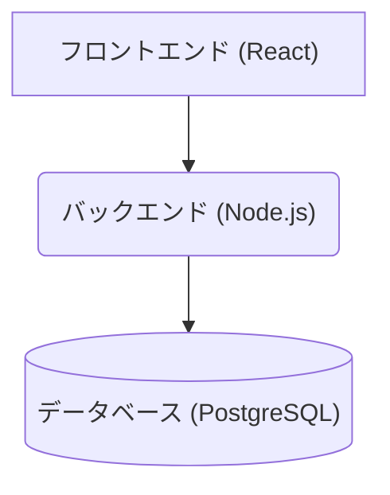

# システム設計書

## 1. 概要

このドキュメントは、AIタスク管理システムの設計について記述したものです。
このシステムは、タスクの一覧表示を主な機能とするWebアプリケーションです。

## 2. アーキテクチャ

このシステムは、以下の3つの主要コンポーネントで構成される、3層アーキテクチャを採用しています。



*   **フロントエンド**: ユーザーインターフェースを提供し、ユーザーとのインタラクションを処理します。
*   **バックエンド**: ビジネスロジックを処理し、データベースとの通信を行います。
*   **データベース**: アプリケーションのデータを永続的に保存します。

## 3. フロントエンド (frontend)

### 3.1. 使用技術

*   **フレームワーク**: React 19.1.0
*   **言語**: TypeScript
*   **ビルドツール**: Vite
*   **スタイリング**: styled-components
*   **パッケージ管理**: npm

### 3.2. 主要なコンポーネント

*   `main.tsx`: アプリケーションのエントリーポイント。ReactコンポーネントをDOMにレンダリングします。
*   `App.tsx`: アプリケーションのルートコンポーネント。タスクデータをバックエンドから取得し、`TaskList`コンポーネントに渡します。
*   `components/TaskList.tsx`: タスクの一覧を表示するコンポーネント。（※現時点では未作成ですが、今後作成される想定です）

### 3.3. APIとの連携

`useEffect`フック内で`fetch` APIを使用し、バックエンドの`/api/tasks`エンドポイントからタスクデータを非同期に取得します。

## 4. バックエンド (backend)

### 4.1. 使用技術

*   **フレームワーク**: Express 4.17.1
*   **言語**: JavaScript (Node.js)
*   **データベースクライアント**: pg 8.7.1
*   **パッケージ管理**: npm

### 4.2. APIエンドポイント

*   `GET /api/tasks`
    *   **説明**: すべてのタスクを取得します。
    *   **レスポンス (JSON)**:
        ```json
        [
            {
                "id": "task-1",
                "title": "Design new user interface mockups",
                "status": "In Progress",
                "assignee": "Alice"
            }
        ]
        ```

### 4.3. データベースとの連携

`pg`ライブラリの`Pool`オブジェクトを使用して、PostgreSQLデータベースに接続し、SQLクエリを実行します。
接続情報は環境変数 `DATABASE_URL` から取得します。

## 5. データベース (db)

### 5.1. 使用技術

*   **データベース管理システム**: PostgreSQL 13

### 5.2. テーブルスキーマ

`init.sql`ファイルによって、`tasks`テーブルが作成されます。

```sql
CREATE TABLE tasks (
    id VARCHAR(255) PRIMARY KEY,
    title VARCHAR(255) NOT NULL,
    status VARCHAR(255) NOT NULL,
    assignee VARCHAR(255)
);
```

### 5.3. 初期データ

`init.sql`ファイルによって、5つのサンプルタスクが`tasks`テーブルに挿入されます。

## 6. インフラストラクチャ

### 6.1. Dockerコンテナ構成

`docker-compose.yml`によって、以下の2つのサービスが定義されています。

*   **`db`**: PostgreSQLデータベースを実行するコンテナ。
    *   データはホストの`./db-data`ディレクトリに永続化されます。
    *   起動時に`./init.sql`を実行してテーブル作成と初期データの投入を行います。
*   **`backend`**: Node.jsバックエンドアプリケーションを実行するコンテナ。
    *   `./backend`ディレクトリの`Dockerfile`を元にビルドされます。
    *   `db`サービスに依存しており、`db`が起動した後に起動します。

## 7. 実行とデプロイ

開発環境の起動手順については、`README.md`の「開発環境の起動方法」セクションを参照してください。
