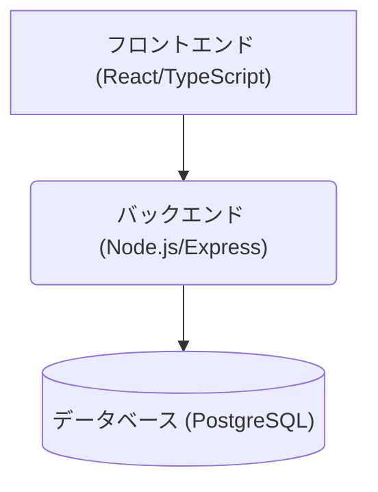

# システム設計書 (v3.0)

## 1. 設計思想とコンセプト (Design Philosophy and Concept)

このドキュメントは、AIタスク管理アプリケーションの技術的な仕様だけでなく、その背景にある設計思想や意思決定のプロセスを記録することを目的とします。これにより、将来の機能追加やメンテナンス、そして私（Gemini）との対話を再開する際の文脈の復元を容易にします。

### 1.1. 基本方針: 迅速なプロトタイピングと段階的成長

*   **なぜこの技術スタックか？**: `React`, `Node.js (Express)`, `PostgreSQL` という組み合わせは、Web開発において非常に標準的で、豊富なドキュメントとエコシステムを持っています。これにより、複雑な設定に時間を費やすことなく、迅速に価値あるプロトタイプを構築することを目指しました。`Docker`の採用も同様に、開発環境の構築をコマンド一発で完了させ、誰でもすぐに開発に参加できることを意図しています。

*   **なぜインライン編集なのか？**: 一般的なWebフォーム（入力画面 → 確認画面 → 完了画面）は、タスク管理のように頻繁に小さな更新が発生するユースケースでは煩雑です。スプレッドシートのように、ユーザーが見ているその場で直接データを書き換えられる**インライン編集**方式を採用することで、クリック数を減らし、思考を中断させないスムーズなUXを提供することを最優先としました。

### 1.2. 意図的な技術的負債と将来の展望

*   **なぜ密結合を許容したか？**: 現在の設計では、特にデータベーススキーマとフロントエンドの型定義が密結合しています（詳細は後述）。これは、開発速度を優先した結果の**意図的な技術的負債**です。小規模なプロトタイプの段階では、スキーマ定義からコードを自動生成するようなツール（例: OpenAPI, GraphQL）を導入するコストよりも、手動で同期を取る方が早いと判断しました。しかし、このドキュメントではそのリスクを明確に記録し、将来プロジェクトが成長する際には、これらのツールの導入を検討すべきであることを示唆しています。

## 2. システム概要 (System Overview)

タスクの進捗管理を行うための、シングルページアプリケーション（SPA）です。主な機能として、タスクの一覧表示、インラインでのタスク編集、新規タスクの追加、複数タスクの一括削除、複数タスクの複製、そして**各タスクに紐づくサブタスクの管理機能**を提供します。

## 3. アーキテクチャ (Architecture)

実績のある標準的な3層アーキテクチャを採用しています。


```mermaid
graph TD
    A["フロントエンド (React/TypeScript)"] --> B("バックエンド (Node.js/Express)");
    B --> C[("データベース (PostgreSQL)")]
```

*   **フロントエンド**: ユーザーとの全インタラクションを担います。`Vite`による高速な開発サーバーでビルドされます。
*   **バックエンド**: フロントエンドからのリクエストに応じてビジネスロジックを実行する、ステートレスなAPIサーバーです。
*   **データベース**: `PostgreSQL`を使用。すべての永続データを管理します。

## 4. フロントエンド (frontend)

### 4.1. 使用技術

*   **フレームワーク**: React
*   **言語**: TypeScript
*   **ビルドツール**: Vite
*   **スタイリング**: styled-components
*   **パッケージ管理**: npm

### 4.2. 状態管理とデータフロー

*   **状態管理の考え方**: この規模のアプリケーションでは、`Redux`のような外部の状態管理ライブラリは過剰と判断し、React標準の`useState`, `useCallback`フックによるシンプルなコンポーネントローカルな状態管理を採用しました。
*   **データフロー**: データは常に親コンポーネント (`TaskManagementPage.tsx`) から子コンポーネント (`TaskList`, `TaskItem`) へ単一方向に流れます（トップダウン）。これにより、データの流れが予測しやすくなり、デバッグが容易になります。

### 4.3. コンポーネントの責務分担 (Atomic Design)

コンポーネントは、再利用性と管理のしやすさを向上させるため、Atomic Designの原則に基づいて以下のディレクトリ構造で管理します。

-   `src/components/atoms`: ボタン、インプット、ラベルなど、それ以上分割できない最小単位のUIコンポーネント。
-   `src/components/molecules`: 複数のAtomを組み合わせて作られた、意味を持つUI部品（例: 検索フォーム、タスク一行）。
-   `src/components/organisms`: 複数のMoleculeやAtomを組み合わせて作られた、自己完結したUIのセクション（例: タスク一覧テーブル全体）。
-   `src/pages`: アプリケーションの各ページを構成するコンポーネント。Organismを組み合わせてレイアウトを定義します。

#### Pages

-   **`TaskManagementPage.tsx`**
    -   **責務**: アプリケーション全体の状態（タスク一覧、選択中のタスクID、ローディング状態など）をすべて保持する、唯一の状態管理コンポーネントです。
    -   **役割**: バックエンドとのAPI通信をすべて担当し、その結果を自身のstateとして保持します。タスクの追加・更新・削除・複製といったロジック（イベントハンドラ）もここで定義し、子コンポーネントには関数としてpropsで渡します。

#### Organisms

-   **`PageHeader.tsx`**: ページ上部に表示されるヘッダー。アプリケーションのタイトルを表示します。
-   **`TaskList.tsx`**
    -   **責務**: `TaskManagementPage.tsx`から受け取ったタスクデータをレイアウトし、テーブルとして表示することに専念します。タスクの一括選択、削除、複製機能も提供します。
    -   **役割**: 自身ではAPI通信を行いません。ユーザーのアクション（ボタンクリックなど）が発生すると、propsで渡された`TaskManagementPage.tsx`の関数を呼び出すだけです。

#### Molecules

-   **`CustomStatusSelect.tsx`**: タスクのステータスを選択するためのドロップダウン。
-   **`TaskItem.tsx`**
    -   **責務**: 1つのタスク行の表示と、その行内での編集機能に専念します。サブタスクの表示/非表示切り替え、およびサブタスクリストの管理も行います。
    -   **役割**: propsで渡された1つのタスク情報を基に、各セルを描画します。入力が行われると、自身のstate (`editingTask`) を一時的に更新し、入力が完了（`onBlur`イベント）した時点で、propsで渡された`onUpdateTask`関数を呼び出して、親コンポーネントに変更を通知します。
-   **`SubtaskItem.tsx`**
    -   **責務**: 1つのサブタスクの表示と、その行内での編集機能に専念します。
    -   **役割**: propsで渡された1つのサブタスク情報を基に、チェックボックスとタイトルを描画します。入力が行われると、propsで渡された`onUpdate`関数を呼び出して、親コンポーネントに変更を通知します。
-   **`SubtaskList.tsx`**
    -   **責務**: 特定のタスクに紐づくサブタスクのリスト表示と、新規サブタスクの追加、複数サブタスクの一括削除機能に専念します。
    -   **役割**: `SubtaskItem`コンポーネントを複数レンダリングし、サブタスクの追加・更新・削除に関するイベントハンドラを親コンポーネントから受け取り、子コンポーネントに渡します。

#### Atoms

-   **`Button.tsx`**: アプリケーション全体で使われるボタンのスタイルを定義します。
-   **`Input.tsx`**: テキストや数値の入力フィールドのスタイルを定義します。
-   **`Select.tsx`**: ドロップダウン選択メニューのスタイルを定義します。

### 4.4. UI/UXデザイン方針

アプリケーション全体のUI/UXは、以下のデザインシステムに基づいて設計します。これにより、一貫性、予測可能性、そして美しさを実現します。

#### 1. カラーパレット (Color Palette)

色は、ユーザーの注意を引きつけ、情報を伝達し、アクションを促すための重要な要素です。

*   **Primary (プライマリー)**
    *   `#425679` (濃い青): 主要なアクション、ヘッダー、フォーカス時のインジケーターなど、最も目立たせたい要素に使用します。
    *   使用例: ページヘッダー、テーブルヘッダー
*   **Secondary (セカンダリー)**
    *   `#E9ECEF` (グレー): 補足的な情報や、非アクティブな状態を示すために使用します。
    *   使用例: 通常のボタンの枠線、プレースホルダーテキスト
*   **Text (テキスト)**
    *   `#5F5F5F` (ほぼ黒): 基本となるテキストカラー。高い可読性を確保します。
    *   `#FFFFFF` (白): 濃い色の背景（プライマリーカラーなど）の上で使用します。
*   **その他強調色**
    *   `#e9b000` (黄) :　プライマリーカラーほどではないが、強調表示すべき情報に割り当てたい色（例： 進行中のタスク）
    *   `#70AD47` (緑) :  ポジティブな印象を与えたい箇所を強調表示する色（例： 完了したタスク）

#### 2. タイポグラフィ (Typography)

フォントのサイズとウェイトは、情報の階層を明確にし、読みやすさを向上させます。（基準: `1rem = 8px`）

*   **基本フォントサイズ**: `1rem` (8px)
*   **見出し (Header)**
    *   `h1`: `1.5rem` (12px), `font-weight: 500` - ページのメインタイトル
*   **テーブル (Table)**
    *   ヘッダー: `1rem` (8px), `font-weight: 600`
    *   ボディ: `1rem` (8px), `font-weight: 400`
*   **ボタン (Button)**
    *   `0.8rem` (6.5px), `font-weight: 500`

### 4.5. 型定義 (TypeScript)

フロントエンドで利用する主要なデータ構造の型定義です。`frontend/src/types.ts` にて管理されています。

*   **Task**
    ```typescript
    export interface Task {
      id: string;
      title: string;
      status: 'Todo' | 'In Progress' | 'Done';
      assignee?: string;
      planned_start_date?: string;
      planned_effort?: number;
      actual_effort?: number;
      subtasks?: Subtask[]; // フロントエンドでの表示用に、関連するサブタスクを保持
    }
    ```
*   **Subtask**
    ```typescript
    export interface Subtask {
      id: string;
      task_id: string;
      title: string;
      status: 'Todo' | 'In Progress' | 'Done';
      assignee?: string;
      planned_start_date?: string;
      planned_effort?: number;
      actual_effort?: number;
    }
    ```

## 5. バックエンド (backend)

### 5.1. 使用技術

*   **フレームワーク**: Express
*   **言語**: JavaScript (Node.js)
*   **データベースクライアント**: pg
*   **ID生成**: uuid

### 5.2. API設計思想 (RESTful原則)

APIは、Webの標準的な設計思想である **REST (Representational State Transfer)** に基づいて設計されています。これにより、各エンドポイントの役割が直感的で予測可能になります。

基本的な考え方は、URLが「何に対して (リソース)」操作をするかを示し、HTTPメソッドが「何をする (操作)」かを示す、という役割分担です。

| HTTPメソッド | 操作 (CRUD) | 目的 | べき等性 | 安全性 |
| :--- | :--- | :--- | :--- | :--- |
| **GET** | **Read** (取得) | 既存のリソースを取得する。 | あり | あり |
| **POST** | **Create** (作成) | 新しいリソースを作成する。 | なし | なし |
| **PUT** | **Update** (更新) | 既存のリソースを全体的に更新（置換）する。 | あり | なし |
| **DELETE** | **Delete** (削除) | 既存のリソースを削除する。 | あり | なし |

-   **べき等性**: 同じリクエストを何度繰り返しても、結果が同じになる性質。
-   **安全性**: サーバー上のリソース状態を変更しない性質。

#### 補足: 複数リソースに対する操作

`POST /api/tasks/delete` や `POST /api/tasks/duplicate` のように、リソースの作成以外で`POST`を使用している箇所があります。これは、リクエストボディに操作対象のID配列 (`ids`) を含める必要があるためです。標準的な`DELETE`メソッドなどはリクエストボディを持つことが一般的ではないため、このような一括処理には`POST`を利用するのが実用的なアプローチです。

### 5.3. APIエンドポイント詳細

#### Tasks
*   `GET /api/tasks`: 全タスクを取得。
*   `POST /api/tasks`: 新規タスクを作成。リクエストボディは不要。
    *   レスポンス: 作成されたタスクオブジェクト。
*   `PUT /api/tasks/:id`: 既存タスクを更新。
    *   リクエストボディ: `title`, `status`, `assignee`, `planned_start_date`, `planned_effort`, `actual_effort` のいずれか、またはすべて。
    *   レスポンス: 更新されたタスクオブジェクト。
*   `POST /api/tasks/delete`: 複数タスクを一括削除。
    *   リクエストボディ: `ids`: 削除するタスクIDの配列。
    *   レスポンス: ステータス204 (No Content)。
*   `POST /api/tasks/duplicate`: 複数タスクを複製。関連するサブタスクも複製される。
    *   リクエストボディ: `ids`: 複製するタスクIDの配列。
    *   レスポンス: 複製されたタスクオブジェクトの配列。

#### Subtasks
*   `GET /api/tasks/:taskId/subtasks`: 特定のタスクに紐づく全サブタスクを取得。
    *   レスポンス: サブタスクオブジェクトの配列。
*   `POST /api/subtasks`: 新規サブタスクを作成。
    *   リクエストボディ: `task_id` (必須), `title` (必須), `status`, `assignee`, `planned_start_date`, `planned_effort`, `actual_effort`。
    *   レスポンス: 作成されたサブタスクオブジェクト。
*   `PUT /api/subtasks/:id`: 既存サブタスクを更新。
    *   リクエストボディ: `title`, `status`, `assignee`, `planned_start_date`, `planned_effort`, `actual_effort` のいずれか、またはすべて。
    *   レスポンス: 更新されたサブタスクオブジェクト。
*   `DELETE /api/subtasks/:id`: サブタスクを削除。
    *   レスポンス: ステータス204 (No Content)。

## 6. データベース (db)

### 6.1. テーブル設計の意図

*   **`tasks`**: タスク管理のコアとなるテーブル。
*   **`subtasks`**: 各タスクに紐づくサブタスクを管理するテーブル。親タスクが削除された場合は、関連するサブタスクも自動的に削除されるように設定 (`ON DELETE CASCADE`)。

### 6.2. テーブルスキーマ

*   **tasks**
    ```sql
    CREATE TABLE tasks (
        id VARCHAR(255) PRIMARY KEY,
        title VARCHAR(255) NOT NULL,
        status VARCHAR(255) NOT NULL,
        assignee VARCHAR(255),
        planned_start_date DATE,
        planned_effort INT,
        actual_effort INT
    );
    ```
*   **subtasks**
    ```sql
    CREATE TABLE subtasks (
        id VARCHAR(255) PRIMARY KEY,
        title VARCHAR(255) NOT NULL,
        status VARCHAR(255) NOT NULL DEFAULT 'Todo',
        assignee VARCHAR(255),
        planned_start_date DATE,
        planned_effort INT,
        actual_effort INT,
        task_id VARCHAR(255) NOT NULL,
        FOREIGN KEY (task_id) REFERENCES tasks(id) ON DELETE CASCADE
    );
    ```

## 7. インフラストラクチャと運用

*   **`docker-compose.yml`**: `db`と`backend`サービスを定義。フロントエンドは、Viteの開発サーバーがHMR（ホットリロード）を提供するため、コンテナ化せずローカルで直接実行する方が開発効率が高いと判断しました。
*   **`restart: always`**: 開発中に予期せぬエラーでコンテナが停止しても自動で復旧し、開発体験を損なわないように設定しています。
*   **DBデータリセット手順**: DBスキーマ (`init.sql`) を変更した際、既存のデータボリューム (`./db-data`) があると変更が反映されない問題がありました。これは、`docker-compose down`後に`./db-data`を手動で削除し、`docker-compose up --build`で再起動することで解決しました。この手順は、スキーマ変更時に必須となります。

## 8. 既知の課題と将来の改善案 (密結合について)

(このセクションの内容は、前回の記述が的確であるため、ほぼそのまま維持します)

現在のアーキテクチャには、開発速度を優先した結果、いくつかの密結合な箇所が存在します。

### 8.1. 【最重要課題】DBスキーマとフロントエンドの型定義の乖離リスク

*   **問題**: DBスキーマの変更が、APIのレスポンス、そしてフロントエンドのTypeScript型定義 (`types.ts`) に**自動的に伝播しません**。これらはすべて開発者が**手動で**一貫性を保つ必要があり、変更箇所を一つでも忘れるとバグの温床となります。
*   **具体例**: `tasks`テーブルに`priority`カラムを追加した場合、`init.sql`, `server.js` (SELECT, UPDATE文), `types.ts` の3箇所すべてを忘れずに修正する必要があります。

### 8.2. 将来的な改善策

この密結合を解消し、システムの堅牢性を高めるため、プロジェクトの成長に合わせて以下の導入を検討すべきです。

*   **スキーマ駆動開発**: **OpenAPI**や**GraphQL**を導入し、スキーマ定義を信頼できる唯一の情報源 (Single Source of Truth) とします。これにより、サーバーとクライアントのコード（特に型定義）を自動生成し、手動での同期作業を撲滅します。
*   **O/Rマッパー (ORM)**: **Prisma**のようなモダンなORMを導入することで、DBスキーマから型安全なデータベースクライアントを生成し、バックエンドコード内でのタイプミスやスキーマとの不整合を防ぎます。